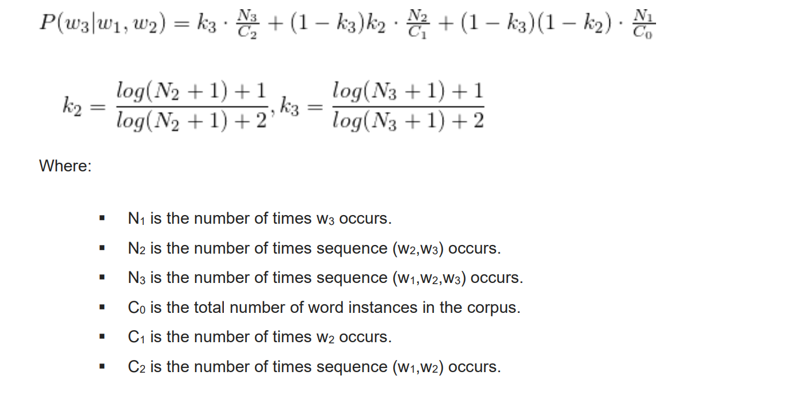

# Knowledge-base for Word Prediction
assignment 2 of distributed systems 1 course.
Amir Mor and Shelly Talis.

## Description:
In this project we generate a knowledge-base for Hebrew word-prediction system, based on
Google 3-Gram Hebrew dataset, using Amazon Elastic Map-Reduce (EMR). The produced
knowledge-base indicates for each pair of words the probability of their possible next words. In
addition, we examine the quality of the algorithm according to statistic measures and manual
analysis.

## Running instructions:


1. Create an S3 bucket.
2. Compile the project and create a jar with `src/main/java/jobs/MR.java` as your main class.
3. Upload your jar to your S3 bucket.
4. Fill `config.properties` file with the followings:
    4.1. `bucketName` - The name of the bucket you want all step outputs and logs to go to.
    4.2. `jarBucketName` - The name of the bucket your jar file resides in.
    4.3.`jarFileName` - The name of the jar you've created at step 2 **without extension**.
5. Run `src/main/java/Main.java`.
6. The final output will be presented inside `finalOutput` folder.

## Map-Reduce Program Flow:

### Step 1 to 3 : Filter & Sum 
* At every step mentioned above we aggregate the 1-gram, 2-gram, and 3-gram respectively to the step index.
* Step1Count1Gram also, counts C0, the sum of all single word occurrences in the data set.
* input : [https://aws.amazon.com/datasets/google-books-ngrams/](https://aws.amazon.com/datasets/google-books-ngrams/) explained here.
* output of each step: <w1,count> or <w1 w2, count> or <w1w2w3, count>
### Step 4: Zipping Step1 With Step2 Outputs
* this step receives as inputs step1 and step2 outputs.
* map-input: receives <w,count> or <w1 w2, w1w2count> as inputs.
* map-output: <w,wcount> or <w2 w1, w1w2count> (inverted w1 w2 so we get w2 count of pair)
* reduce input: <w,wcount> or <w2 w1, w1w2count>
* reduce output: <w1 w2,w2count w1w2count>

### Step 5: Zipping Step3 With Step4 Outputs
* this step receives as inputs step3's and step4's outputs.
* map-input: receives <w1 w2,w2count w1w2count> or <w1 w2 w3, w1w2w3count> as inputs.
* map-output: <w1 w2,w2count w1w2count> or (<w1 w2 w3, w1w2count> and <w2 w3 w1, filler w1w2count> ).
 We inverted w1 w2, so we get w2w3 count of pair.
 Also added filler, so we get an indicator that the trigram is inverted.
* reduce input: <w1 w2,w2count w1w2count> or (<w1 w2 w3, w1w2count> and <w2 w3 w1, filler w1w2count> )
* reduce output: <w1 w2 w3, w1 w2 w2count w1w2count w1w2w3count> 
 or <w1 w2 w3, w2 w3 w3count w2w3count w1w2w3count>.
 The words w1 w2 or w2 w3 are added to value so we know the association to the numbers.(indicators)

### Step 6: Probability Calculation

* We calculate the probability and match it with it's Trigram.




### Step 7: Sorting

* Sorting the records as follows:
    (1) by w1w2, ascending;
    (2) by the probability for w3, descending.

## Statistics With | Without Combiners:


###1. Map-Reduce Job1Count1Gram:
####without combiners
```
Map input records=44400490
Map output records=44052707
Map output bytes=739397191
Map output materialized bytes=141017639
```
####with combiners
```
Map input records=44400490
Map output records=44052707
Map output bytes=739397191
Map output materialized bytes=6596696
Combine input records=44052707
Combine output records=639838
```
###2. Map-Reduce Job2Count2Gram:
####without combiners
```
Map input records=252069581
Map output records=200198280
Map output bytes=4573482682
Map output materialized bytes=618979167
```
####with combiners
```
Map input records=252069581
Map output records=200198280
Map output bytes=4573482682
Map output materialized bytes=53594831
Combine input records=200198280
Combine output records=4131527
```

###3. Map-Reduce Job3Count3Gram:
####without combiners
```
Map input records=163471963
Map output records=71119513
Map output bytes=2044604623
Map output materialized bytes=233927198
```
####with combiners
```
Map input records=163471963
Map output records=71119513
Map output bytes=2044604623
Map output materialized bytes=26357969
Combine input records=71119513
Combine output records=1686129
```
###4. Map-Reduce Job4Zip1With2:
```
Map input records=4771284
Map output records=4771284
Map output bytes=105519635
Map output materialized bytes=54525582
```
###5. Map-Reduce Job5Zip3With4:
```
Map input records=5817578
Map output records=7503696
Map output bytes=230089604
Map output materialized bytes=120264129
```
###6. Map-Reduce Job6CalcProb:
```
Map input records=3372236
Map output records=3372236
Map output bytes=194378168
Map output materialized bytes=95346697
```
###7. Map-Reduce Job7Sort:
```
Map input records=1686118
Map output records=1686118
Map output bytes=142608316
Map output materialized bytes=90588615
```
## Analysis:
1.
```
מעולם לא היה	0.06087367159570296
מעולם לא ראה	0.010430444906123453
מעולם לא אמרתי	0.0034656738129348217
מעולם לא שמע	0.0033773883343821373
מעולם לא קרה	0.0031895572997431496
```
2. 
```
עוד הפעם אל	0.023711892738278
עוד הפעם לפני	0.004782642802686864
עוד הפעם עם	0.004432485943823508
עוד הפעם אני	0.004275467339066747
עוד הפעם היה	0.0033471957890491367
```
3.
```
על האינטרסים של	0.3826141942332372
על האינטרסים שלהם	0.06533105459465596
על האינטרסים המשותפים	0.01617041578614505
על האינטרסים היהודיים	0.015593396591454914
על האינטרסים שלנו	0.011230046508911394
````
4.
```
על הרצפה על	0.0047502956018259405
על הרצפה כמו	0.0031350071578297146
על הרצפה כדי	0.0030173515011893922
על הרצפה היתה	0.002929050884890985
על הרצפה לא	0.0022900851213583204
````
5.
```
בבית הכנסת הוא	0.004001010863369178
בבית הכנסת המרכזי	0.003482708481324336
בבית הכנסת הקטן	0.0024217292559547896
בבית הכנסת בכל	0.0017951447078596524
בבית הכנסת להתפלל	0.0015599047330973614
````
6.
```
ואני רוצה להגיד	0.03491614870801481
ואני רוצה לחיות	0.008725487566413923
ואני רוצה לתת	0.007221875497209596
ואני רוצה לחזור	0.006970275844652624
ואני רוצה מאוד	0.006279631115458156
```
7.
```
אני מקווה שאתה	0.02177949694001574
אני מקווה שיהיה	0.0078027268457909645
אני מקווה שנוכל	0.0036451531387852116
אני מקווה שאצליח	0.003086384367550929
אני מקווה שעכשיו	0.00225883058317326
```
8.
```
אם נשוה את	0.5400610250977342
אם נשוה אותו	0.04434839513779365
אם נשווה בין	0.02779558977424922
אם נשווה זאת	0.0247363950588636
```
9.
```
ויאמר אל משה	0.060942260829651256
ויאמר אל נא	0.037677913406445315
ויאמר אל אהרן	0.021703021686176115
ויאמר אל תרד	0.009891414874832893
ויאמר אל יעקב	0.007763502521700464
```
10.
```
אדוני אבי הרב	0.030612022954259695
אדוני אבי זקיני	0.02433536579590258
אדוני אלי לא	0.33204629778851297
אדוני היושב ראש	0.1309613213694191
אדוני ידבר נא	0.6928961504655091
```
we do believe our project is somewhat accurate, the result make sense.
common knowledge says that moses is first in "ויאמר אל" and להגיד is the first in "ואני רוצה ".(at least for the chatty among us ;) ) 
the probabilities seem good, reasonable.


